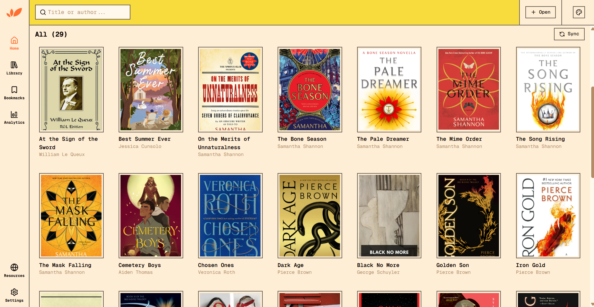
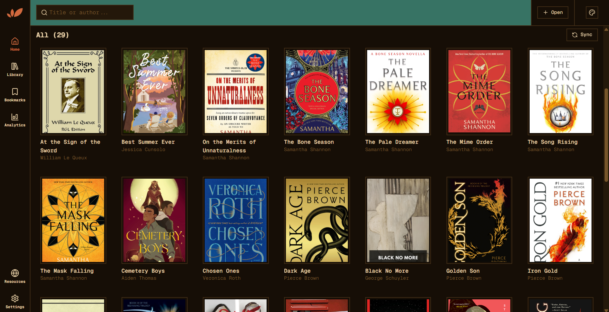
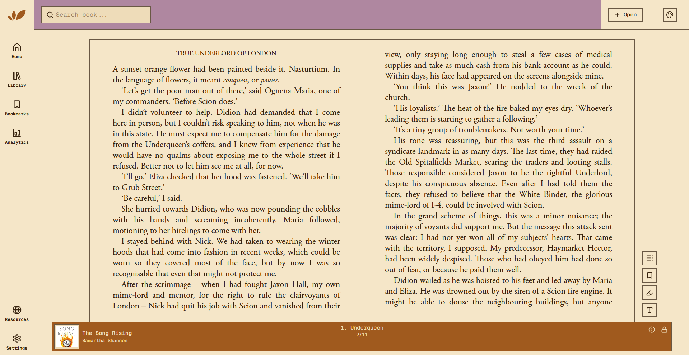

# 🍃 Leafr

> A clean, distraction-free EPUB reader for the desktop.

Leafr is a minimal desktop EPUB reader built for people who just want to read. No clutter, no subscriptions, no cloud sync required — just you and your books.



---

## Features

- 📖 **EPUB support** — Open and read any standard EPUB file
- 🎨 **Themes** — Switch between light and dark themes to suit your environment
- 🔖 **Reading progress** — Picks up right where you left off
- 🗂️ **Chapter navigation** — Jump to any chapter instantly via the TOC sidebar
- 📍 **Location tracking** — See your current page and chapter at a glance
- ⌨️ **Keyboard navigation** — Use arrow keys to flip pages

---

## Screenshots






---

## Getting Started

### Prerequisites

- [Node.js](https://nodejs.org/) v18+
- [pnpm](https://pnpm.io/) (or npm/yarn)

### Installation

```bash
# Clone the repo
git clone https://github.com/Adedero/leafr.git
cd leafr

# Install dependencies
pnpm install

# Start in development mode
pnpm dev
```

### Build

```bash
# Build for your platform
pnpm build
```

Distributable files will be output to the `dist/` directory.

---

## Tech Stack

- **[Electron](https://www.electronjs.org/)** — Desktop shell
- **[Vue 3](https://vuejs.org/)** — UI framework
- **[epub.js](https://github.com/futurepress/epub.js/)** — EPUB rendering
- **[Tailwind CSS](https://tailwindcss.com/)** — Styling

---

## Roadmap

- [ ] Annotations and highlights
- [ ] Bookmarks
- [ ] Font size and family controls
- [ ] Library management
- [ ] Search within book

---

## Contributing

Contributions are welcome. Please open an issue first to discuss what you'd like to change.

---

## License

[MIT](./LICENSE)

---

<p align="center">Made with ☕ and quiet mornings.</p>
